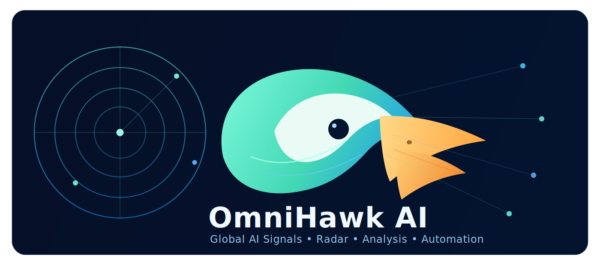

<div align="center">

# 🦅 OmniHawk AI

### Global AI Intelligence OS for the Agent Era

From papers and frontier model releases to capital markets, policy, and OSS ecosystems:
fetch, dedupe, analyze, subscribe, and push from one platform, with MCP + CLI interfaces for agent workflows.

[](#)
[](#docker-start)
[](#mcp-service)
[](#agent-cli-new)
[](LICENSE)

**📣 Subscription Push Channels**


**🏷️ Core Tags**


<p align="center">
  
</p>

[中文](README.md) | **English**

</div>

## 🚀 Why This Project Exists
AI signals are highly fragmented and move fast. Manual tracking usually breaks down due to:

- Fragmented channels: papers, vendor announcements, earnings, policy updates, and OSS trends are disconnected.
- Recency noise: stale news keeps resurfacing and crowds out new signal.
- Deduplication pain: syndicated reposts trigger repeated ingestion and repeated notifications.
- Automation gap: difficult to integrate "intelligence fetching" directly into agent pipelines.

`OmniHawk AI` turns this into an always-on, extensible intelligence layer that agents can call directly.

## 👥 Who It Is For
- AI researchers: track papers and method evolution continuously.
- Product and engineering teams: track releases, tooling, and developer signals.
- Investment and strategy teams: track earnings, capex, financing, and market movements.
- Policy and compliance teams: track regulation and AI safety incidents across regions.
- Agent builders: use MCP/CLI tools as programmable capabilities.

## 🧭 Six Independent Pages (Parallel, Not Nested)
| Page | Main Use | Typical Sources |
| --- | --- | --- |
| AI Paper Radar | Academic tracking and deep paper analysis | arXiv and research feeds |
| AI Frontier | Model, product, and technology updates | official sites, vendor blogs, labs |
| AI Finance | Capital market and company intelligence | earnings, call transcripts, market feeds, financing/M&A |
| AI Industry Reports | Industry and institutional research | global think tanks, institutions, whitepapers |
| AI Policy & Safety | Regulation and risk monitoring | regulators, policy bodies, safety incident sources |
| AI OSS & Dev Signals | Open-source tools and dev ecosystem trends | GitHub Trending + README semantic filtering |

> All six pages are independent. Each page has isolated settings, subscriptions, and push rules.

## ⚙️ Core Capabilities
- Multi-source ingestion with region-oriented source organization.
- Persistent history + dedup indexes to prevent repeat fetches/pushes.
- Recency control (for example, a 90-day window) to suppress stale items.
- LLM summary/analysis with Chinese and English output modes.
- Multi-channel notifications: `feishu`, `wework`, `wechat`, `telegram`, `dingtalk`, `ntfy`, `bark`, `slack`, `email`.
- Scheduled fetching and optional auto-push subscription jobs.
- MCP tool interface for protocol-based agent integration.
- Agent CLI (new) for direct, scriptable local tool invocation.

## 🧱 System Architecture
```text
             +---------------------------+
             |      Data Sources         |
             | papers / frontier / ...   |
             +-------------+-------------+
                           |
                           v
+----------------+   +------------+   +-------------------+
| Fetch & Dedupe |-->| Persistence|-->| Analysis & Routing|
+----------------+   +------------+   +-------------------+
                           |                    |
                           v                    v
                    +-------------+     +------------------+
                    | Web Console |     | Notification Push |
                    +------+------+     +------------------+
                           |
                +----------+----------+
                | MCP Server / CLI    |
                | (agent automation)  |
                +---------------------+
```

---

## ⚡ Quick Start
### 1) 🧩 Requirements
- Python `>= 3.12`
- `uv` is recommended
- Docker users: `Docker` + `Docker Compose`

### 2) 🖥️ Local Startup (Development)
```bash
uv sync --locked
```

1. Run the main fetch/runtime once:
```bash
omnihawk-ai
```

2. Run the interactive Web console (6-page UI):
```bash
python -m trendradar.web.panel_server --port 8080 --output-dir output
```

3. Start MCP service (HTTP):
```bash
omnihawk-ai-mcp --transport http --host 0.0.0.0 --port 3333
```

### 3) 🐳 Docker Start
```bash
docker compose -f docker/docker-compose.yml up -d --build
```

Default ports:
- Web service: `WEBSERVER_PORT` (default: `8080`)
- MCP endpoint: `http://127.0.0.1:3333/mcp`

Stop:
```bash
docker compose -f docker/docker-compose.yml down
```

View logs:
```bash
docker compose -f docker/docker-compose.yml logs -f
```

---

## 🤖 Agent CLI (New)
To let agents/scripts call OmniHawk tools directly without MCP transport, this repo adds `omnihawk-ai-cli`.

### 🎯 Design Goals
- Same capability surface as MCP tools (same tool names and argument semantics).
- JSON input and JSON output for automation-friendly integration.
- Works well with shell scripts, CI pipelines, and agent executors.

### 🧪 Basic Command
```bash
omnihawk-ai-cli tools
```

### 📌 Common Examples
1. List all available tools and params:
```bash
omnihawk-ai-cli tools
```

2. Call a tool with inline JSON:
```bash
omnihawk-ai-cli call list_scope_items --args '{"scope":"market_finance","limit":20}'
```

3. Call a tool with args file:
```bash
omnihawk-ai-cli call upsert_scope_subscription --args-file ./payload.json
```

4. Override project root and output directory:
```bash
omnihawk-ai-cli --project-root . --output-dir ./output call get_project_overview
```

5. Compact JSON output (pipeline-friendly):
```bash
omnihawk-ai-cli call list_scopes --compact
```

### Windows PowerShell Examples (Recommended)
1. Use `ConvertTo-Json` with `--args-file` (most reliable):
```powershell
$payload = @{ scope = "market_finance"; limit = 20 } | ConvertTo-Json -Compress
$payload | Set-Content -Encoding utf8 .\payload.json
omnihawk-ai-cli call list_scope_items --args-file .\payload.json --compact
```

2. Use a here-string args file:
```powershell
@'
{
  "scope": "frontier",
  "max_per_source": 20,
  "source_ids": ["openai-news", "anthropic-news"]
}
'@ | Set-Content -Encoding utf8 .\payload.json

omnihawk-ai-cli call fetch_scope_items --args-file .\payload.json --compact
```

3. Tools that need no args can be called directly:
```powershell
omnihawk-ai-cli call get_project_overview --compact
```

### 🧾 Exit Codes
- `0`: success
- `1`: runtime/tool execution error
- `2`: invalid params, unknown tool, or malformed JSON

### 🛠️ CLI Parameters and Coverage
CLI fixed arguments:

| Level | Parameter | Description |
| --- | --- | --- |
| Global | `--project-root` | Override project root |
| Global | `--output-dir` | Override output directory |
| Global | `--compact` | Emit compact JSON |
| Subcommand | `tools` | List available tools |
| Subcommand | `call <tool>` | Invoke a tool |
| `call` option | `--args` | Inline JSON args |
| `call` option | `--args-file` | Load JSON args from file |

Tool business arguments are defined per tool. Use:

```bash
omnihawk-ai-cli tools --compact
```

Coverage boundary:
- Covers all currently exposed MCP tool capabilities (22 tools) including overview, scope fetch/list/settings/subscriptions, and paper intelligence/subscriptions.
- Does not directly manage process/container lifecycle (for example starting/stopping Docker or Web server processes).
- Does not perform browser UI interactions directly, but covers equivalent data-layer operations (settings, fetch, subscriptions, push).

---

## 🔌 MCP Service
### Start
```bash
# stdio
python -m mcp_server.server --transport stdio

# http
python -m mcp_server.server --transport http --host 0.0.0.0 --port 3333
```

HTTP endpoint:

`http://127.0.0.1:3333/mcp`

### MCP Tool Groups
1. Project overview
- `get_project_overview`
- `list_pages`
- `list_scopes`

2. Global settings
- `get_global_settings`
- `save_global_settings`

3. Scope data and fetching
- `list_scope_sources`
- `list_scope_items`
- `fetch_scope_items`
- `get_scope_settings`
- `save_scope_settings`

4. Scope subscriptions
- `list_scope_subscriptions`
- `upsert_scope_subscription`
- `delete_scope_subscription`
- `run_scope_subscriptions`

5. Paper intelligence
- `list_papers`
- `get_paper_detail`
- `deep_analyze_paper`
- `set_paper_action`

6. Paper subscriptions
- `list_paper_subscriptions`
- `upsert_paper_subscription`
- `delete_paper_subscription`
- `run_paper_subscriptions`

---

## 🧠 Configuration
Main config directory: `config/`

Key files:
- `config/config.yaml`: main runtime config (fetching, AI, push, storage)
- `config/timeline.yaml`: schedule presets and timing rules
- `config/frequency_words.txt`: keyword frequency rules
- `config/ai_interests.txt`: topic interests
- `config/ai_analysis_prompt.txt`: analysis prompt template
- `config/ai_translation_prompt.txt`: translation prompt template

Runtime output directory: `output/`

Common persistent files:
- `output/ai_progress_items.json`
- `output/ai_progress_seen.json`
- `output/panel_settings.json`
- `output/progress_page_settings.json`
- `output/panel_subscriptions.json`
- `output/progress_subscriptions.json`
- `output/news/*.db`
- `output/rss/*.db`

---

## 📣 Notification Channels
Implemented consistently across backend + frontend + MCP + CLI:
- `feishu`
- `wework`
- `wechat` (personal WeChat via WeCom text mode)
- `telegram`
- `dingtalk`
- `ntfy`
- `bark`
- `slack`
- `email`

---

## 🗂️ Project Structure
```text
.
├─ trendradar/                # Core runtime (fetch/analyze/push/web)
│  ├─ __main__.py             # Main entry
│  ├─ agent_cli.py            # Agent CLI entry (new)
│  └─ web/panel_server.py     # Interactive console server
├─ mcp_server/                # MCP server
├─ config/                    # Configuration and prompt templates
├─ docker/                    # Dockerfile / compose / entry scripts
├─ docs/assets/               # README visual assets (including OmniHawk SVG)
├─ output/                    # Runtime persistent data
├─ README.md
└─ README-EN.md
```

---

## ❓FAQ
### Q1: What is the relation between CLI and MCP?
CLI calls the same MCP-compatible tool functions directly. Use MCP for protocol integration and CLI for local scripting/automation.

### Q2: Can CLI cover all features?
CLI covers all capabilities currently exposed by MCP (22 tools). If an action in the UI maps to data-layer operations (fetch, query, settings, subscriptions, push), it is typically automatable via CLI.

### Q3: Why am I seeing duplicate messages?
Check:
- whether `output/ai_progress_seen.json` is persisted/mounted correctly
- whether duplicated subscription rules are configured
- whether `timeline` and page-level subscriptions are triggering overlapping windows

### Q4: What is the minimum agent integration path?
Start with:
```bash
omnihawk-ai-cli call get_project_overview
```
Then call `list_scope_items` / `list_papers` / `run_*_subscriptions` as needed.

---

## 🧭 Roadmap and Contribution
- Roadmap: [ROADMAP.md](ROADMAP.md)
- Expansion plan: [docs/EXPANSION-PLAN-ZH.md](docs/EXPANSION-PLAN-ZH.md)
- Contribution guide: [CONTRIBUTING.md](CONTRIBUTING.md)

---

## 🙏 Acknowledgements and Reference
- This project references and is inspired by [TrendRadar](https://github.com/sansan0/TrendRadar).
- OmniHawk AI independently extends the architecture with six parallel pages, regionalized source strategy, multi-channel subscriptions, and integrated MCP + Agent CLI workflows.

---

## 📄 License
This project is licensed under [MIT License](LICENSE).
