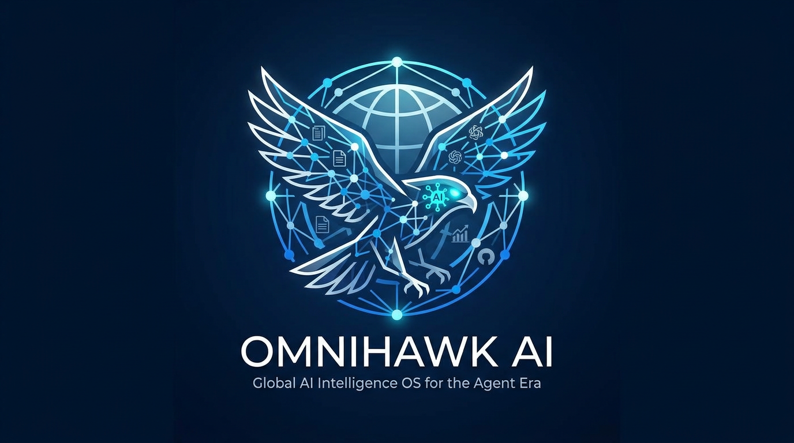

<div align="center">

# 🦅 IA OmniHawk

### Sistema operativo global de inteligencia artificial para la era de los agentes

Desde documentos y lanzamientos de modelos fronterizos hasta mercados de capital, políticas y ecosistemas de OSS:
obtenga, deduplica, analice, suscriba y envíe desde una plataforma, con interfaces MCP + CLI para flujos de trabajo de agentes.

[](#)
[](#docker-start)
[](#mcp-service)
[](#agent-cli-new)
[](LICENSE)

**📣 Canales push de suscripción**


**🏷️ Etiquetas importantes**


<p align="center">
  
</p>

[中文](README.md) | [English](README-EN.md) | [हिन्दी](README-HI.md) | **Español** | [العربية](README-AR.md) | [Français](README-FR.md) | [Português](README-PT.md) | [বাংলা](README-BN.md) | [日本語](README-JA.md) | [한국어](README-KO.md)

</div>

## 🚀 Por qué existe este proyecto
Las señales de IA están muy fragmentadas y se mueven rápidamente. El seguimiento manual suele fallar debido a:

- Canales fragmentados: artículos, anuncios de proveedores, ganancias, actualizaciones de políticas y tendencias de OSS están desconectados.
- Ruido reciente: las noticias obsoletas siguen resurgiendo y desplazan la nueva señal.
- Problemas de deduplicación: las publicaciones sindicadas desencadenan ingestiones repetidas y notificaciones repetidas.
- Brecha de automatización: difícil integrar la "búsqueda de inteligencia" directamente en los canales de agentes.

"OmniHawk AI" convierte esto en una capa de inteligencia extensible y siempre activa a la que los agentes pueden llamar directamente.

## 👥 Para quién es
- Investigadores de IA: realice un seguimiento continuo de la evolución de los artículos y los métodos.
- Equipos de productos e ingeniería: seguimiento de lanzamientos, herramientas y señales de desarrolladores.
- Equipos de inversión y estrategia: seguimiento de ganancias, gasto de capital, financiación y movimientos del mercado.
- Equipos de políticas y cumplimiento: realice un seguimiento de los incidentes de seguridad de IA y regulaciones en todas las regiones.
- Constructores de agentes: utilice herramientas MCP/CLI como capacidades programables.

## 🧭 Seis páginas independientes (paralelas, no anidadas)
| Página | Uso principal | Fuentes típicas |
| --- | --- | --- |
| Radar de papel con IA | Seguimiento académico y análisis profundo de artículos. | arXiv y feeds de investigación |
| Frontera de la IA | Actualizaciones de modelos, productos y tecnología. | sitios oficiales, blogs de proveedores, laboratorios |
| Finanzas de IA | Mercado de capitales e inteligencia empresarial | ganancias, transcripciones de llamadas, información del mercado, financiación/fusiones y adquisiciones |
| Informes de la industria de la IA | Investigación industrial e institucional. | think tanks globales, instituciones, documentos técnicos |
| Política y seguridad de IA | Regulación y seguimiento de riesgos. | reguladores, organismos normativos, fuentes de incidentes de seguridad |
| Señales de desarrollo y OSS de IA | Herramientas de código abierto y tendencias del ecosistema de desarrollo | Tendencias de GitHub + filtrado semántico README |

> Las seis páginas son independientes. Cada página tiene configuraciones aisladas, suscripciones y reglas de inserción.

## ⚙️ Capacidades principales
- Ingestión de múltiples fuentes con organización de fuentes orientada a la región.
- Historial persistente + índices de deduplicación para evitar búsquedas/empujones repetidos.
- Control de actualidad (por ejemplo, una ventana de 90 días) para suprimir elementos obsoletos.
- Canal de traducción unificado (cualquier idioma de destino) para títulos, análisis de LLM y contenido push.
- Notificaciones multicanal: `feishu`, `wework`, `wechat`, `telegram`, `dingtalk`, `ntfy`, `bark`, `slack`, `email`.
- Estrategias de push inteligentes: `diaria`/`incremental`/`realtime`.
- Búsqueda programada y trabajos de suscripción de envío automático opcionales.
- Interfaz de herramienta MCP para integración de agentes basada en protocolos.
- CLI del agente (nuevo) para la invocación directa y programable de herramientas locales.

## 🌐 Canal de traducción unificado (cualquier idioma de destino)
- Un canal en todas las capas: "título", "resumen/análisis de LLM" y "carga útil de notificación".
- Soporte de idioma de destino: "inglés", "coreano", "japonés", "francés", "chino", "chino tradicional", además de idiomas de destino personalizados.
- Control de costos: traducción por lotes, llenado de campos incremental y reutilización persistente para evitar llamadas repetidas a la API.
- Comportamiento consistente: Web, MCP y CLI comparten la misma semántica de `output_language`, por lo que la interfaz de usuario y las salidas push permanecen sincronizadas.

Ejemplo (CLI):
```bash
# Set AI Finance page output language to Japanese
omnihawk-ai-cli call save_scope_settings --args '{"scope":"market_finance","output_language":"Japanese"}'

# Fetch using this scope and language policy
omnihawk-ai-cli call fetch_scope_items --args '{"scope":"market_finance","max_per_source":20}'
```

## 🧠 Estrategia de empuje inteligente
| Estrategia | Desencadenar | Mejor para | Característica |
| --- | --- | --- | --- |
| `diario` | Resumen diario programado | Resumen ejecutivo/equipo | Agregación completa de temas sobre cadencia fija |
| `incremental` | Ventana programada, solo nueva | Monitoreo de rutina | Entrega incremental sin duplicados |
| `tiempo real` | Empuje inmediato desencadenado por evento | Lanzamientos de modelos importantes, rupturas de políticas, alertas de financiación | Sin esperas por el cronograma, máxima puntualidad |

Notas:
- La estrategia se configura por regla de suscripción y puede diferir en las 6 páginas.
- Se puede combinar con filtros (fuente, región, tipo de evento, palabras clave) para un enrutamiento de alertas preciso.

## 🧱 Arquitectura del sistema
```text
             +---------------------------+
             |      Data Sources         |
             | papers / frontier / ...   |
             +-------------+-------------+
                           |
                           v
+----------------+   +------------+   +-------------------+
| Fetch & Dedupe |-->| Persistence|-->| Analysis & Routing|
+----------------+   +------------+   +-------------------+
                           |                    |
                           v                    v
                    +-------------+     +------------------+
                    | Web Console |     | Notification Push |
                    +------+------+     +------------------+
                           |
                +----------+----------+
                | MCP Server / CLI    |
                | (agent automation)  |
                +---------------------+
```

---

## ⚡ Inicio rápido
### 1) 🧩 Requisitos
-Python `>= 3.12`
- Se recomienda `uv`
- Usuarios de Docker: `Docker` + `Docker Compose`

### 2) 🖥️ Startup local (Desarrollo)
```bash
uv sync --locked
```

1. Ejecute la recuperación/tiempo de ejecución principal una vez:
```bash
omnihawk-ai
```

2. Ejecute la consola web interactiva (UI de 6 páginas):
```bash
python -m omnihawk_ai.web.panel_server --port 8080 --output-dir output
```

3. Inicie el servicio MCP (HTTP):
```bash
omnihawk-ai-mcp --transport http --host 0.0.0.0 --port 3333
```

### 3) 🐳 Inicio de Docker
```bash
docker compose -f docker/docker-compose.yml up -d --build
```

Puertos predeterminados:
- Servicio web: `WEBSERVER_PORT` (predeterminado: `8080`)
- Punto final MCP: `http://127.0.0.1:3333/mcp`

Detener:
```bash
docker compose -f docker/docker-compose.yml down
```

Ver registros:
```bash
docker compose -f docker/docker-compose.yml logs -f
```

---

## 🤖 Agente CLI (Nuevo)
Para permitir que los agentes/scripts llamen a las herramientas OmniHawk directamente sin transporte MCP, este repositorio agrega `omnihawk-ai-cli`.

### 🎯 Objetivos de diseño
- Misma superficie de capacidad que las herramientas MCP (mismos nombres de herramientas y semántica de argumentos).
- Entrada JSON y salida JSON para una integración fácil de automatizar.
- Funciona bien con scripts de shell, canalizaciones de CI y ejecutores de agentes.

### 🧪 Comando básico
```bash
omnihawk-ai-cli tools
```

### 📌 Ejemplos comunes
1. Enumere todas las herramientas y parámetros disponibles:
```bash
omnihawk-ai-cli tools
```

2. Llame a una herramienta con JSON en línea:
```bash
omnihawk-ai-cli call list_scope_items --args '{"scope":"market_finance","limit":20}'
```

3. Llame a una herramienta con el archivo args:
```bash
omnihawk-ai-cli call upsert_scope_subscription --args-file ./payload.json
```

4. Anule la raíz del proyecto y el directorio de salida:
```bash
omnihawk-ai-cli --project-root . --output-dir ./output call get_project_overview
```

5. Salida JSON compacta (compatible con canalizaciones):
```bash
omnihawk-ai-cli call list_scopes --compact
```

### Ejemplos de Windows PowerShell (recomendado)
1. Utilice `ConvertTo-Json` con `--args-file` (el más confiable):
```powershell
$payload = @{ scope = "market_finance"; limit = 20 } | ConvertTo-Json -Compress
$payload | Set-Content -Encoding utf8 .\payload.json
omnihawk-ai-cli call list_scope_items --args-file .\payload.json --compact
```

2. Utilice un archivo de argumentos de cadena aquí:
```powershell
@'
{
  "scope": "frontier",
  "max_per_source": 20,
  "source_ids": ["openai-news", "anthropic-news"]
}
'@ | Set-Content -Encoding utf8 .\payload.json

omnihawk-ai-cli call fetch_scope_items --args-file .\payload.json --compact
```

3. Las herramientas que no necesitan argumentos se pueden llamar directamente:
```powershell
omnihawk-ai-cli call get_project_overview --compact
```

### 🧾 Códigos de salida
- `0`: éxito
- `1`: error de ejecución de tiempo de ejecución/herramienta
- `2`: parámetros no válidos, herramienta desconocida o JSON con formato incorrecto

### 🛠️ Parámetros y cobertura de CLI
Argumentos fijos CLI:

| Nivel | Parámetro | Descripción |
| --- | --- | --- |
| Global | `--raíz del proyecto` | Anular la raíz del proyecto |
| Global | `--dir-salida` | Anular el directorio de salida |
| Global | `--compacto` | Emitir JSON compacto |
| Subcomando | `herramientas` | Listar herramientas disponibles |
| Subcomando | `llamar <herramienta>` | Invocar una herramienta |
| opción "llamar" | `--argumentos` | Argumentos JSON en línea |
| opción "llamar" | `--archivo-args` | Cargar argumentos JSON desde el archivo |

Los argumentos comerciales de las herramientas se definen por herramienta. Usar:

```bash
omnihawk-ai-cli tools --compact
```

Límite de cobertura:
- Cubre todas las capacidades de las herramientas MCP actualmente expuestas (22 herramientas), incluida la descripción general, la búsqueda/lista/configuraciones/suscripciones del alcance y las suscripciones/inteligencia en papel.
- No gestiona directamente el ciclo de vida del proceso/contenedor (por ejemplo, iniciar/detener procesos de Docker o del servidor web).
- No realiza interacciones de la interfaz de usuario del navegador directamente, pero cubre operaciones de capa de datos equivalentes (configuración, recuperación, suscripciones, envío).

---

## 🔌 Servicio MCP
### Comenzar
```bash
# stdio
python -m mcp_server.server --transport stdio

# http
python -m mcp_server.server --transport http --host 0.0.0.0 --port 3333
```

Punto final HTTP:

`http://127.0.0.1:3333/mcp`

### Grupos de herramientas MCP
1. Descripción general del proyecto
- `get_project_overview`
- `lista_páginas`
- `lista_ámbitos`

2. Configuración global
- `get_global_settings`
- `save_global_settings`

3. Alcance y obtención de datos
- `lista_alcance_fuentes`
- `lista_alcance_elementos`
- `fetch_scope_items`
- `get_scope_settings`
- `save_scope_settings`

4. Suscripciones de alcance
- `lista_alcance_suscripciones`
- `upsert_scope_subscription`
- `eliminar_alcance_suscripción`
- `run_scope_subscriptions`

5. Inteligencia en papel
- `lista_papeles`
- `get_paper_detail`
- `deep_analyze_paper`
- `set_paper_action`

6. Suscripciones en papel
- `lista_papel_suscripciones`
- `upsert_paper_subscription`
- `eliminar_suscripción_de_papel`
- `run_paper_subscriptions`

---

## 🧠 Configuración
Directorio de configuración principal: `config/`

Archivos clave:
- `config/config.yaml`: configuración principal del tiempo de ejecución (obtención, IA, inserción, almacenamiento)
- `config/timeline.yaml`: programación preestablecida y reglas de tiempo
- `config/frequency_words.txt`: reglas de frecuencia de palabras clave
- `config/ai_interests.txt`: intereses del tema
- `config/ai_analysis_prompt.txt`: plantilla de solicitud de análisis
- `config/ai_translation_prompt.txt`: plantilla de solicitud de traducción

Directorio de salida en tiempo de ejecución: `salida/`

Archivos persistentes comunes:
- `salida/ai_progress_items.json`
- `salida/ai_progress_seen.json`
- `salida/panel_settings.json`
- `salida/progress_page_settings.json`
- `salida/panel_subscriptions.json`
- `salida/progreso_subscripciones.json`
- `salida/noticias/*.db`
- `salida/rss/*.db`

---

## 📣 Canales de notificación
Implementado consistentemente en backend + frontend + MCP + CLI:
-`feishu`
- `trabajamos`
- `wechat` (WeChat personal a través del modo de texto WeCom)
- `telegrama`
- `dingtalk`
-`ntfy`
- `ladrar`
- `flojo`
- `correo electrónico`

---

## 🗂️ Estructura del proyecto
```text
.
├─ omnihawk_ai/                # Core runtime (fetch/analyze/push/web)
│  ├─ __main__.py             # Main entry
│  ├─ agent_cli.py            # Agent CLI entry (new)
│  └─ web/panel_server.py     # Interactive console server
├─ mcp_server/                # MCP server
├─ config/                    # Configuration and prompt templates
├─ docker/                    # Dockerfile / compose / entry scripts
├─ docs/assets/               # README visual assets (including OmniHawk SVG)
├─ output/                    # Runtime persistent data
├─ README.md
└─ README-EN.md
```

---

## ❓Preguntas frecuentes
### P1: ¿Cuál es la relación entre CLI y MCP?
CLI llama directamente a las mismas funciones de herramienta compatibles con MCP. Utilice MCP para la integración de protocolos y CLI para secuencias de comandos/automatización locales.

### P2: ¿Puede CLI cubrir todas las funciones?
CLI cubre todas las capacidades actualmente expuestas por MCP (22 herramientas). Si una acción en la interfaz de usuario se asigna a operaciones de capa de datos (obtención, consulta, configuración, suscripciones, envío), normalmente se puede automatizar a través de CLI.

### P3: ¿Por qué veo mensajes duplicados?
Controlar:
- si `output/ai_progress_seen.json` persiste/se monta correctamente
- si están configuradas reglas de suscripción duplicadas
- si las suscripciones a nivel de página y de línea de tiempo activan ventanas superpuestas

### P4: ¿Cuál es la ruta mínima de integración del agente?
Comience con:
```bash
omnihawk-ai-cli call get_project_overview
```
Luego llame a `list_scope_items`/`list_papers`/`run_*_subscriptions` según sea necesario.

---

## 🙏 Agradecimientos y Referencias
- Este proyecto hace referencia y está inspirado en [TrendRadar](https://github.com/sansan0/TrendRadar).
- OmniHawk AI amplía de forma independiente la arquitectura con seis páginas paralelas, estrategia de fuente regionalizada, suscripciones multicanal y flujos de trabajo integrados MCP + Agent CLI.

---

## 📄 Licencia
Este proyecto tiene licencia [Licencia MIT] (LICENCIA).
